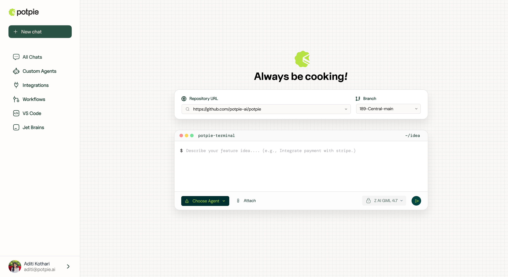

<p align="center">
  <a href="https://potpie.ai?utm_source=github">
    <picture>
      <source media="(prefers-color-scheme: dark)" srcset="../assets/readme_logo_dark.svg" />
      <source media="(prefers-color-scheme: light)" srcset="../assets/logo_light.svg" />
      
    </picture>
  </a>
</p>


<p align="center">
  <strong>User Interface</strong>
</p>


<p align="center">

</p>

<p align="center">
  <a href="https://docs.potpie.ai"></a>
  <a href="https://github.com/potpie-ai/potpie/blob/main/LICENSE"></a>
  <a href="https://github.com/potpie-ai/potpie"></a>
  <a href="https://discord.gg/ryk5CMD5v6"></a>
</p>

## 📋 Table of Contents

- [Overview](#-overview)
- [Features](#-features)
- [Quick Start](#-quick-start)
- [Development](#-development)
  - [Local Development Mode](#local-development-mode)
  - [Production Mode](#production-mode)
- [Contributing](#-contributing)
- [License](#-license)

## 🚀 Overview

Potpie is an open-source platform that creates AI agents specialized in your codebase, enabling automated code analysis, testing, and development tasks. By building a comprehensive knowledge graph of your code, Potpie's agents can understand complex relationships and assist with everything from debugging to feature development.

This repository contains the User Interface for the Potpie platform.

## ✨ Features

- **Custom AI Agents**: Create agents tailored to your specific codebase from a single prompt
- **Pre-Built Agents**: Choose from available list of Q&A, Debugging, Unit Test, Integration Test, Low Level Design, Code Generation Agents
- **Chat**: Easy to use chat interface to interact with your agents with streaming support.

## 🏁 Quick Start

1. Clone the repository:
   ```bash
   git clone https://github.com/potpie-ai/potpie-ui.git
   cd potpie-ui
   ```

2. Copy the required configurations:
   ```bash
   cp .env.template .env
   ```

3. Install dependencies and run the development server:
   ```bash
   pnpm install
   pnpm build
   pnpm run dev
   ```

4. Open [http://localhost:3000](http://localhost:3000) with your browser to see the result.

## 💻 Development

### Local Development Mode

This project supports a local development mode that allows you to run the app without external service dependencies. The app automatically detects if configuration for these services is missing and falls back to mock implementations:

- **Firebase Authentication**: Uses a mock user with predetermined credentials
- **PostHog Analytics**: Uses a no-op implementation
- **Formbricks Bug Reporting**: Disabled in local mode

#### How to Use Local Development Mode

1. Create a `.env` file without the following environment variables:
   - Firebase: `NEXT_PUBLIC_FIREBASE_API_KEY`, `NEXT_PUBLIC_FIREBASE_AUTH_DOMAIN`, etc.
   - PostHog: `NEXT_PUBLIC_POSTHOG_KEY`, `NEXT_PUBLIC_POSTHOG_HOST`
   - Formbricks: `NEXT_PUBLIC_FORMBRICKS_ENVIRONMENT_ID`, `NEXT_PUBLIC_FORMBRICKS_API_HOST`

2. Run the application normally with:
   ```bash
   pnpm run dev
   ```

3. The app will automatically detect missing configurations and use mock implementations.

4. You'll be automatically logged in with a mock user (uid: 'local-dev-user', email: 'local-dev@example.com')

### Production Mode

For production deployment, you'll need to set up the following services:

1. **Firebase Authentication**: Set up Firebase credentials for authentication
2. **PostHog Analytics**: Configure PostHog for analytics tracking (optional)
3. **Formbricks**: Set up for bug reporting (optional)

Configure your environment variables in `.env` file and run:

```bash
pnpm run build
pnpm start
```

## 👥 Contributing

Contributions are welcome! Please feel free to submit a Pull Request.

1. Fork the repository
2. Create your feature branch (`git checkout -b feature/amazing-feature`)
3. Commit your changes (`git commit -m 'Add some amazing feature'`)
4. Push to the branch (`git push origin feature/amazing-feature`)
5. Open a Pull Request

## 📄 License

This project is licensed under the Apache 2.0 License - see the [LICENSE](LICENSE) file for details.
